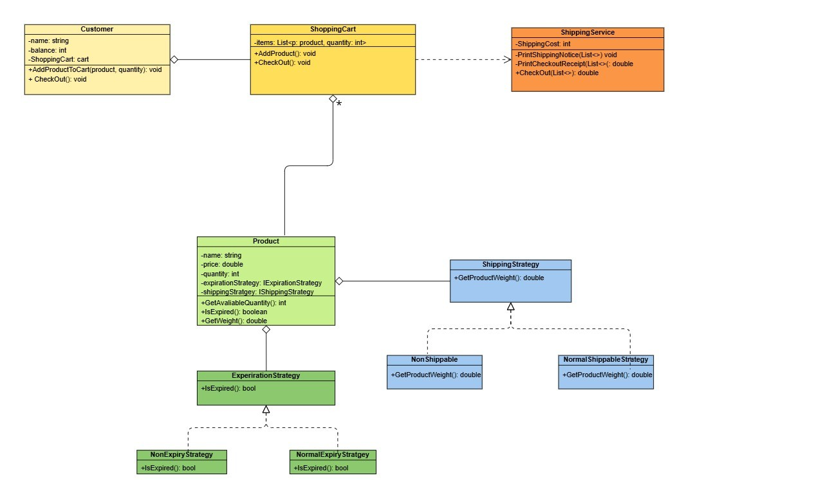
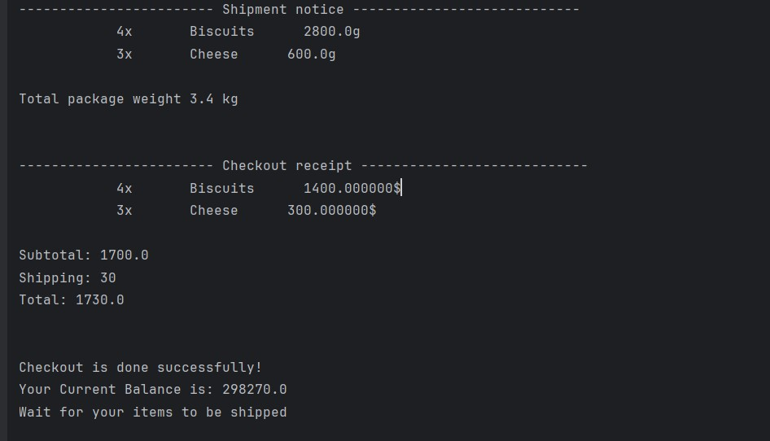
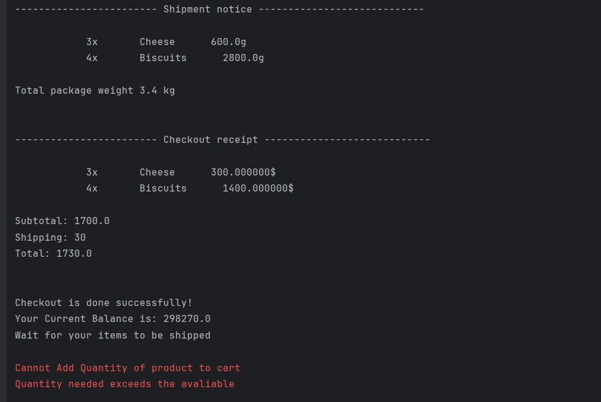
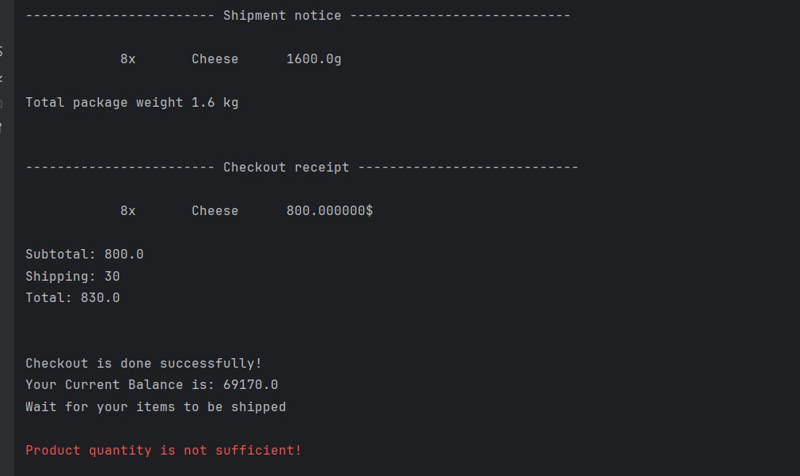
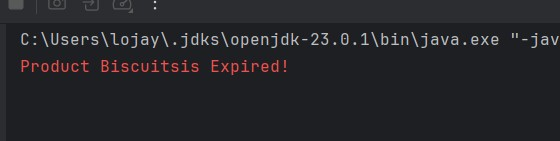
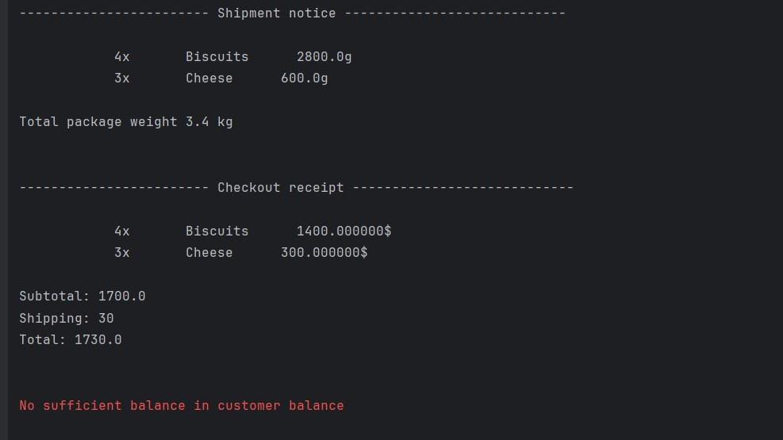
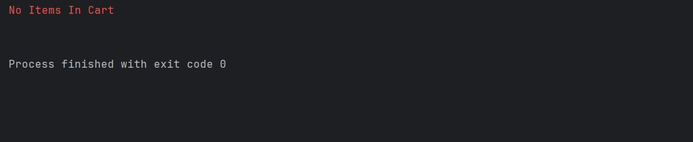

# Fawry Rise Journey

My Solution for Fawry Full Stack Development Internship Challenge
## Design 
I thought about making both the expiry date and the shipping as a startegy bec of some reasons
* These properties are not shared between all variables so it is more readable to put NonExpiryStrategy than setting
it to null and using if conditions
* Later on out system might need a new expiry way to be added 


## Class Diagram




## Test Cases 
### First Test: Normal Without Any Errors
```java
judy.AddProductToCart(cheese, 3);
judy.AddProductToCart(biscuits, 4);
judy.CheckOut();
```
**Output** 



### Second Test: Customer couldnot Buy bec quantity needed exceeds what is found in stock
cheeses have 10 items so judy could buy successfully but ali cannot 
```java
judy.AddProductToCart(cheese, 3);
judy.AddProductToCart(biscuits, 4);
udy.CheckOut();
// quantity exceeds what is found
ali.AddProductToCart(cheese, 8);
```

**Output**



### Third Test: Customer couldnot Buy bec quantity needed exceeds what is found in stock
cheeses have 10 items so here ali could buy but judy no, because in my assumption adding the product to cart doesnot mean
we have bought it, buying is confirmed only when checking out 
```java
judy.AddProductToCart(cheese, 3);
judy.AddProductToCart(biscuits, 4);
ali.AddProductToCart(cheese, 8);
// ali could buy successfully bec he checked out before judy
ali.CheckOut();
judy.CheckOut();
```


**Output**



### Forth Test: Expired Date

```java
// try when cheese & biscuits are expired
judy.AddProductToCart(cheese, 3);
judy.AddProductToCart(biscuits, 4);
judy.AddProductToCart(scratchCard, 4);

judy.CheckOut();
```

**Output**



### FiFth Test: No Sufficient Balance
```java
Customer judy = new Customer("Judy", 300);
judy.AddProductToCart(cheese, 3);
judy.AddProductToCart(biscuits, 4);

judy.CheckOut();
```

**Output**



### Sixth Test: No Items to checkout

```java
// Checking out without adding items
 judy.CheckOut();

```
**Output**

